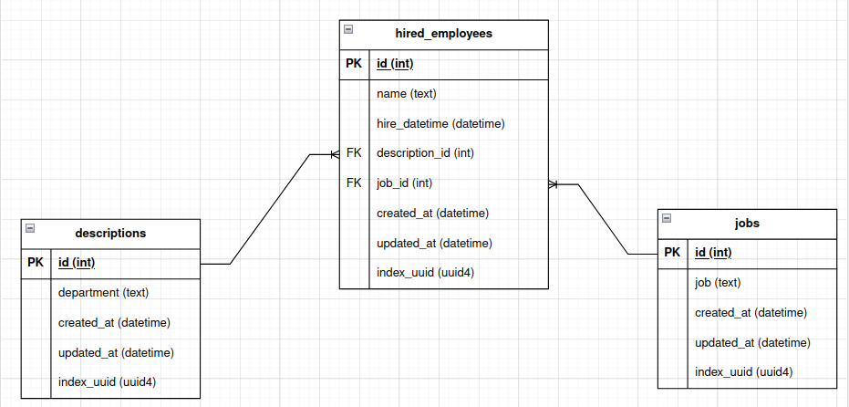
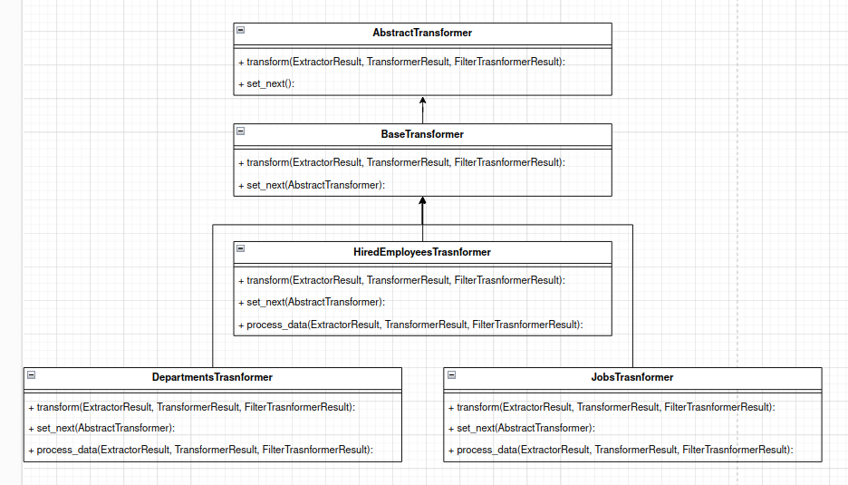
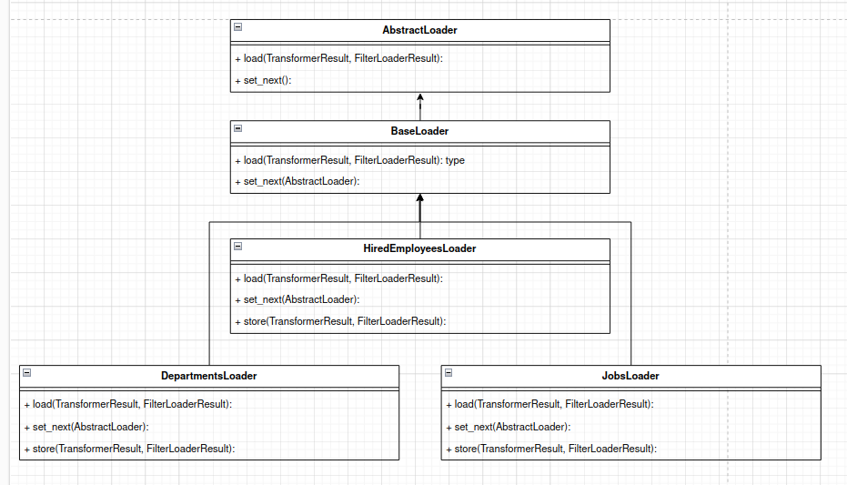
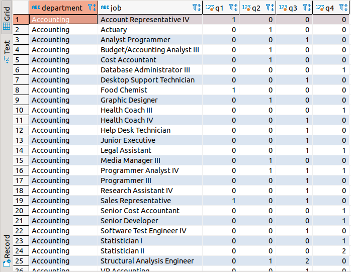
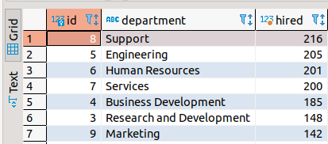
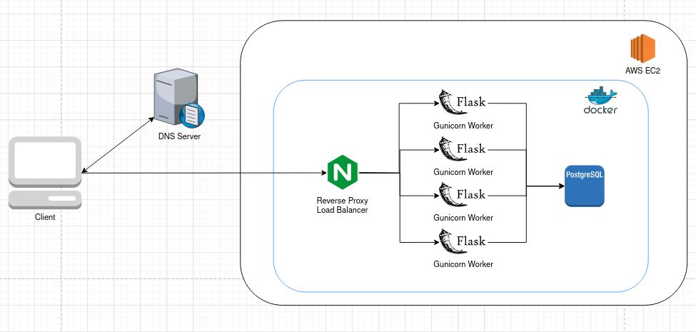
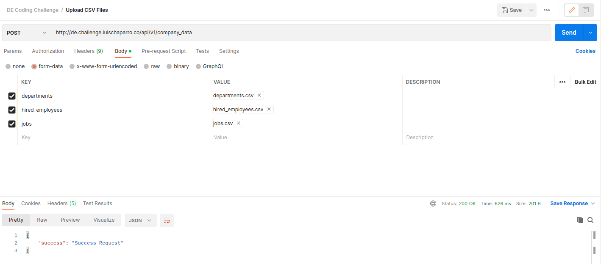
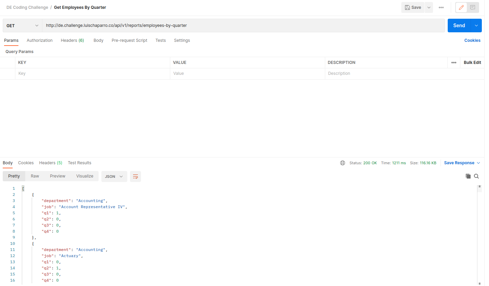
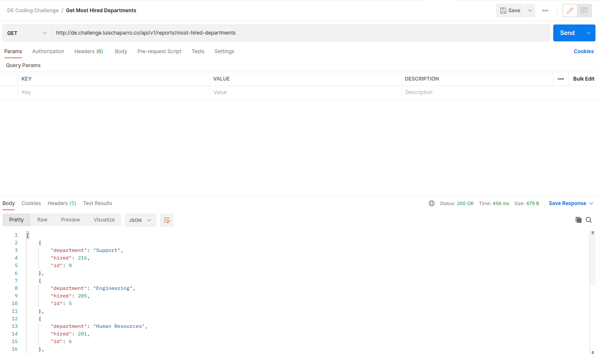

# Data Engineering Coding Challenge

This is the repository of a REST API to store and retrieve company information. This project was developed during Globant's recruitment process.
Here is described the architecture and the functionality of the application.

## Architecture

The REST API is developed with the following tech stack:

* Python (3.10)
* Flask (2.2.2) + Gunicorn (21.2.0)
* Postgresql (15.4)
* Nginx (1.24.0)
* AWS EC2

This API is built and executed with Docker and Docker-Compose.

### Python & Flask

The modules and packages of the application are the following:

* `app.py`: file where the application is defined and executed. The database and the endpoints are associated to the app here.

* `application/blueprints`: package where endpoints and views are defined. These endpoints are distributed in two modules (blueprints): `company_data` for the first part of the test, and `reports` for the second part of the test.

* `application/tests`: package with the unit tests of the application

* `application/utils`: package with the utilities of the application.

### Database

The database uses the postgresql engine of income information in the csv files. The entity-relationship model is the following:



### Blueprints

#### Company Data

This module receives the income information from the CSV files. It is composed by the following stages:

* Extractor: it reads the income information using pandas library. It expects well-formatted and comma-separated CSV files. If one of the income files is not well-formatted, the application raises an exception and returns an error code (400). The extractor is capable of reading one or multiple files with the same key. It excepts to receive the following keys: `departments`, `jobs` and `hired_employees`.
* Transformer: it processes the information obtained in the extractor stage. The Chain of Responsibility design pattern was implemented in this stage to process the information (departments -> jobs -> hired_employees). In order to asure referential integrity and data quality, it filters the rows without values of primary and foreign keys. In a further work, the filtered information could be stored in AWS S3 for tracing purposes. The UML diagram of this stage is the following:



If the application have to scale, it provides a defined signature to implement more transformers.

* Loader: it stores the information in the database. The Chain of Responsibility design pattern was implemented in this stage to process the information in order to avoid stored information without proper relationship: for example, it does not store a hired_employee without a job or a defined department. The order of the chain of the responsibility is the following: departments -> jobs -> hired_employees. In order to asure referential integrity and data quality, it filters the rows without values of primary and foreign keys. In a further work, the filtered information could be stored in AWS S3 for tracing purposes. The UML diagram of this stage is the following:



If the application have to scale, it provides a defined signature to implement more loaders.

Each stage receives and returns a defined data structure, using Pydantic models to improve readability and manageability.

#### Reports

This module returns the Q employment and the most hired employees by department reports. With the stored information in the previous section, it executes two SQL queries with CTEs, multiple joins and sub-queries, to return the information.

Q Employment Sample:



Most Hired Department Employees Sample:



### Utils

- DB Connectors Classes: It was implemented a Factory design pattern to instance different connector classes. It was implemented a connector for the Postgresql database with a standard signature. If it necessary to implement use a different database, it is easier to switch the database with the factory class and the standard signature in the code.

## Deployment

The REST API is deployed in AWS, using the EC2 service. Nginx is used as a reverse proxy and load balancer. Gunicorn is used to fork 4 workers of the flask application to guarantee a high availability of the application.

The architecture of the application is the following:



## Functionality

### Endpoints use

The URL of the REST API is http://de.challenge.luischaparro.co/

#### First endpoint: `POST /api/v1/company_data`

It receives the CSV files with the `multipart/form-data`. It expects the following body:

```json
{
  "departments": <departments.csv>,
  "jobs": <jobs.csv>,
  "hired_employees": <hired_mployees.csv>
}
```

It stores (insert/update) in batch the income information using the `company_data` blueprint logic. It returns a 400 HTTP Code if the income data is bad-formatted.

**Success Response Sample**:



#### Second endpoint: `GET /api/v1/reports/employees-by-quarter`

It returns the employment by each quarter in 2021.

**Success Response Sample**:



#### Third endpoint: `GET /api/v1/reports/most-hired-departments`

It returns the most hired amount of employees by each department in 2021.

**Success Response Sample**:



## Local usage of the REST API.

To build and run the application locally, create the `.env` files based on the `.env.example` files in the repository.

To build the image, execute the following command:

```
docker-compose build
```

To run the services, execute the following command:

```
docker-compose up -d
```

To run database migrations, execute the following commands:

```
docker-compose run --rm web flask db init
docker-compose run --rm web flask db migrate
docker-compose run --rm web flask db upgrade
```

## Tests

Execute the following command to run the unit tests:

```
docker-compose run --rm web python -m unittest
```